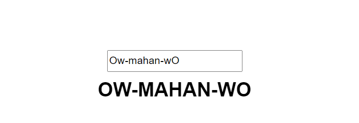
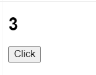
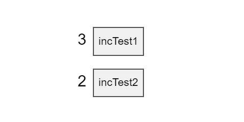
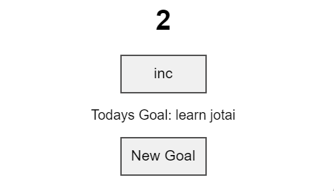
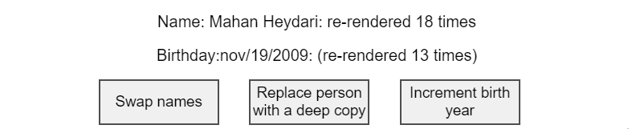
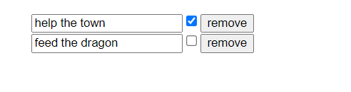
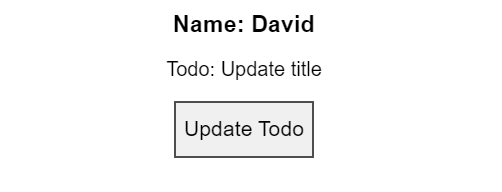
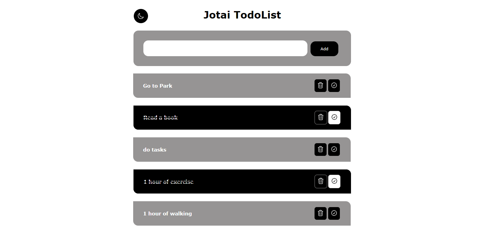

--> you can Download Pdf this Readme . It is available in the repository files

# How to learn Jotai ?!


### First of all, I want to give a basic explanation about stateManagement.

### In our state managers, we have three types of architecture: flux, proxy, and atomic, each of which has a different structure and is not very similar. In flux architecture we have redux and zustand for example and in proxy architecture we have Mobx for example and in Atomic architecture we have Jotai or Recoil for example

# What is Jotai ?

### Jotai is a relatively new state management library for React which works with (atom). It's simple, but make no mistakes, it's a robust library.

### Jotai is based on the new Recoil pattern and library by Facebook.

# Why we should learn Jotai ?!

### Redux is often used in large-scale projects due to its ability to maintain states at a large scale. If we want to use state managers in a small project, Redux doesn't seem reasonable and we have to use the context API. However, Jotai comes to our aid and makes managing states in the program easy with its atomic structure and is very fast and convenient. This is one reason to learn Jotai, and another reason may be that we have the opportunity to get acquainted with other architectures and state managers.

# How to learn Jotai ?

### We learn step by step with the official jotai document and its practice. Let's go to start.

# Lesson 1:

## at first you most install jotai in Project:"

```
npm install jotai
###
yarn add jotai
```

## and at second step we should set Provider for jotai to be able to access them:

```javascript
./main.jsx

import React from 'react'
import ReactDOM from 'react-dom/client'
import App from './App.tsx'

import {Provider} from 'jotai'

ReactDOM.createRoot(document.getElementById('root')!).render(
  <React.StrictMode>
  <Provider>
    <App />
  </Provider>
  </React.StrictMode>,
)

```

## Creating your first atom

### Jotai atoms are small isolated pieces of state. Ideally, one atom contains very small data. Here's how you create your first atom.

```javascript
import { atom } from "jotai";
const counter = atom(0);
```

### t is as simple to use as React’s integrated (useState) hook, but all state is globally accessible.

```javascript
const [count, setCounter] = useAtom(counter);
```

### The atom we created is to be passed to (useState) hook with the help of jotai (useAtom) function, which returns an array, where the 1st element is the value of atom, and the 2nd element is a function used to set the value of the atom.

### Jotai considers anything to be an atom so you can create any type of atom you want whether it is atom of objects, arrays, or nested objects.

```javascript
const friendObj = atom({ name: "Shahin", online: false });
const cities = atom(["Shiraz", "Tehran", "Kerman"]);
const nestedObj = atom({ friend1: { name: "Korosh", age: 20 } });
```

# Example Lesson1 :

### in this example we write a very small app with jotai so with Click in “Click for increased ” Button add 1 count to counter variable and more ….

```javascript
import { atom, useAtom } from "jotai";

const counter = atom(0);

export default function ExLesson1() {
  const [count, setCounter] = useAtom(counter);
  const setCountHandler = () => setCounter((count) => (count += 1));
  return (
    <div>
      <button onClick={setCountHandler}>Click for Increased</button>
      <p>{count}</p>
    </div>
  );
}
```

### As we learned in the above material, we made a number type variable using atoms and stored it inside a variable, and using useAtom, which has a structure similar to useState in React, we were able to update or use it.

# Lesson 2

### Persisting state value. In this lesson, we will take a look at how we can persist the state value to (localStorage) with jotai (atoms). Persisting state to localStorage can be challenging. You might want to persist the user's preferences or data for their next session.

### Jotai (atomWithStorage) is a special kind of atom that automatically syncs the value provided to it with (localstorage) or sessionStorage, and picks the value upon the first load automatically. It's available in the jotai/utils module. To persist our theme atom simply create it with the atomWithStorage atom.

### Note: In first Parameter we pass keyword for toggle and second Parameter we pass that status (true/false)

```javascript
const theme = atomWithStorage("dark", false);
```

# Example Lesson 2 :

### In this Example we have a Toggler button for change new Theme in app , So Click that button and to next Step we Refresh page and Theme changed and not be set to default theme . this is Amazing

```javascript
import { useAtom } from "jotai";
import { atomWithStorage } from "jotai/utils";

const theme = atomWithStorage("dark", false);

export default function ExLesson2() {
  const [Theme, setTheme] = useAtom(theme);
  const handleThemeClick = () => setTheme(!Theme);
  return (
    <div className={Theme ? "dark" : "light"}>
      <h1>This is a theme switcher</h1>
      <button onClick={handleThemeClick}>{Theme ? "DARK" : "LIGHT"}</button>
    </div>
  );
}
```

# Lesson 3 :

## Read Only atoms:

### Readonly atoms are used to read the value of the other atoms. You can't set or change their value directly because these atoms rely on their parent atoms.

```javascript
const textAtom = atom("readonly");
const uppercase = atom((get) => get(textAtom).toUpperCase());
```

### you can with (get) method get a value of atom but not available method for set value on that atom its call (Read Only Atoms)

```javascript
const firstName = atom("Amir");
const lastName = atom("Jamshidi");
const fullName = atom((get) => get(firstName) + " " + get(lastName));
```

### you can get one or two and more values of atoms and use it same Example above.

## Example Lesson 3:

```javascript
import { atom, useAtom } from "jotai";

const text = atom("Ow-mahan-wO");
const Uppercase = atom((get) => get(text).toUpperCase());

export default function ExLesson3() {
  const [lowercaseText, setLowercaseText] = useAtom(text);
  const [uppercaseText] = useAtom(Uppercase);
  const handleChange = (e) => setLowercaseText(e.target.value);
  return (
    <div className="app">
      <input value={lowercaseText} onChange={handleChange} />
      <h1>{uppercaseText}</h1>
    </div>
  );
}
```

###



## Awsome feature:

### You can do more than just simply read the value of other atoms like (filter) and sorted out them or (map) over the values of the parent atom. And this is the beauty of it, Jotai gracefully lets you create dumb atoms derivated from even more dumb atoms.Here is a example of getting the list of all online and offline friends:

```javascript
const friendsStatus = atom([
  { name: "Reza", online: false },
  { name: "Shayan", online: true },
  { name: "Mahan", online: false },
]);

const onlineFriends = atom((get) =>
  get(friendsStatus).filter((item) => item.online)
);
const offlineFriends = atom((get) =>
  get(friendsStatus).filter((item) => !item.online)
);
```

### it is greate and easy!!!

# Lesson 4:

### Read Write atoms :

### These atoms are the combination of both read-only and write-only atoms.

```javascript
const count = atom(1);
export const readWriteAtom = atom(
  (get) => get(count),
  (get, set) => {
    set(count, get(count) + 1);
  }
);
```

### The first parameter is for reading and the second is for modifying the atom value. Since the readWriteAtom is capable to read and set the original atom value, so we can only export readWriteAtom atom and can hide the original atom in a smaller scope.

## Example Lesson 4:

```javascript
import { atom, useAtom } from "jotai";

const counter = atom(1);
export default function ExLesson4() {
  const readWriteAtom = atom(
    (get) => get(counter),
    (get, set) => {
      set(counter, get(counter) + 1);
    }
  );
  const [count, setCount] = useAtom(readWriteAtom);
  return (
    <div>
      <h1>{count}</h1>
      <button onClick={setCount}>Click</button>
    </div>
  );
}
```

### In this example we have a button and h1 element that show count and when clicked button, count increased 1 and update element value:



# Lesson 5

### Atom Creators:

### An atom creator means simply a function that returns an atom or a set of atoms. It's just a function and it's not some features that the library provides, but it's an important pattern to make a fairly complex use case. This avoids the boilerplate of having to set up another atom just to update the state of the first.

```javascript
const createCountIncreasedAtoms = (initialValue) => {
  const InitialAtom = atom(initialValue);
  const ValueAtom = atom((get) => get(InitialAtom));
  const IncreamentAtom = atom(null, (get, set) =>
    set(InitialAtom, (n) => n + 1)
  );
  return [ValueAtom, IncreamentAtom];
};

const [TestAtom1, TestIncAtom1] = createCountIncreasedAtoms(0);
const [TestAtom2, TestIncAtom2] = createCountIncreasedAtoms(0);
```

### Consider this case that use it of write atoms that we learned in previous Lessons:

```javascript
const TestAtom1 = atom(0);
const TestAtom2 = atom(0);
const TestincAtom1 = atom(null, (get, set) => {
  set(TestAtom1, (n) => n + 1);
});
const TestincAtom2 = atom(null, (get, set) => {
  set(TestAtom2, (n) => n + 1);
});
```

### Although you can attach the suitable actions to the setter of the respective atom, but this also increases boilerplate code when there are more atoms in your code.

## So simply replace this with the atom creators function.

### how do we do this ?! like example below.

# Example Lesson5 :

```javascript
import { atom, useAtom } from "jotai";

const createCountIncreasedAtoms = (initialValue) => {
  const InitialAtom = atom(initialValue);
  const ValueAtom = atom((get) => get(InitialAtom));
  const IncreamentAtom = atom(null, (get, set) =>
    set(InitialAtom, (n) => n + 1)
  );
  return [ValueAtom, IncreamentAtom];
};

const [TestAtom1, TestIncAtom1] = createCountIncreasedAtoms(0);
const [TestAtom2, TestIncAtom2] = createCountIncreasedAtoms(0);

function ExLesson5() {
  const [TestCount1] = useAtom(TestAtom1);
  const [, incTest1] = useAtom(TestIncAtom1);
  const [TestCount2] = useAtom(TestAtom2);
  const [, incTest2] = useAtom(TestIncAtom2);

  const onClick1 = () => {
    incTest1();
  };
  const onClick2 = () => {
    incTest2();
  };

  return (
    <>
      <div>
        <span>{TestCount1}</span>
        <button onClick={onClick1}>incTest1</button>
      </div>
      <div>
        <span>{TestCount2}</span>
        <button onClick={onClick2}>incTest2</button>
      </div>
    </>
  );
}
```



### in this example we have two atoms that should be update similar each other .

### we write a atom creator and handle proccess in that and make it reusable , with pass parameter to custome value in atom creator function .

<<<<<<< HEAD

# Lesson 6

## Async Read Atoms:

## Using async atoms, you gain access to real-world data while still managing them directly from your atoms and with incredible ease.

## We separate async atoms in two main categories , Async read atoms and Async write atoms.

## Like example below :

```javascript
const counter = atom(0);
const asyncAtom = atom(async (get) => get(counter) * 5);
```

## Jotai is inherently leveraging Suspense to handle asynchronous flows.

```javascript
<Suspense fallback={<span>loading...</span>}>
  <AsyncComponent />
</Suspense>
```

### But there is a more jotai way of doing this with the loadable api present in jotai/utils. By simply wrapping the atom in loadable util and it returns the value with one of the three states: loading, hasData and hasError.

```javascript
import { loadable } from "jotai/utils"
import { atom, useAtom } from 'jotai'

const countAtom = atom(0);
const asyncAtom = atom(async (get) => get(countAtom));
const loadableAtom = loadable(asyncAtom)
const AsyncComponent = () => {
  const [value] = useAtom(loadableAtom)
  if (value.state === 'hasError') return <div>{value.error}</div>
  if (value.state === 'loading') {
    return <div>Loading...</div>
  }
  return <div>Value: {value.data}</div>
```

# Example Lessson 6 :

```javascript
import { atom, useAtom } from "jotai";
import { Suspense } from "react";

const counter = atom(1);
const asyncAtom = atom(async (get) => get(counter) * 5);

function AsyncComponent() {
  const [asyncCount] = useAtom(asyncAtom);
  return (
    <div className="app">
      <h1>{asyncCount}</h1>
    </div>
  );
}

export default function ExLesson6() {
  return (
    <Suspense fallback={<span>loading...</span>}>
      <AsyncComponent />
    </Suspense>
  );
}
```

### In example above we have a count atom that read with async and do it count \* 5

### And in suspense we pass a fallback props with value that wana show in loading new value .

# Lesson 7

## Async Write Atoms

## In Async write atoms the write function of atom returns a promise.

## We pass two parameter in atom , first parameter all the time like write atoms , are null and second parameter are callback fn (set , get) with this the difference we write async keyword before it.

## Like this :

```javascript
const counter = atom(0);
const asyncAtom = atom(null, async (set, get) => {
  // await something
  set(counter, get(counter) + 1);
});
```

## This is important that , An important take here is that async write function does not trigger the Suspense

### But an interesting pattern that can be achieved with Jotai is switching from async to sync to trigger suspending when wanted.

```javascript
const request = async () => fetch("https://api/...").then((res) => res.json());
const baseAtom = atom(0);
const Component = () => {
  const [value, setValue] = useAtom(baseAtom);
  const handleClick = () => {
    setValue(request()); // Will suspend until request resolves
  };
  // ...
};
```

## Example Lesson 7 :

### In this example we have two component (Suspence , AsyncComponent)

### In AsyncComponent we have a counter atom that with Click in inc Button increased and fetch data of JsonPlaceholder api (fake api) and show it.

### And in Suspence we have a default object with data (id,title,etc.) and write Async request for get data in api and so on we take data and set in useAtom till we can use them .

### And set Click event on button, until the click on button we set request data on atom .

```javascript
./App.js

import { atom, useAtom } from 'jotai';
import Suspense from './Suspense.js';

const counter = atom(1);
const asyncAtom = atom(null, async (get, set) => {
    await fetch('https://jsonplaceholder.typicode.com/todos/');
    set(counter, get(counter) + 1);
});
function AsyncComponent() {
  const [count] = useAtom(counter);
  const [, incCounter] = useAtom(asyncAtom);
  return (
    <div className="app">
      <h1>{count}</h1>
      <button onClick={incCounter}>inc</button>
    </div>
  )
}
export default function ExLesson7() {
   return (
    <div>
      <AsyncComponent />
      <Suspense />
    </div>
  )
}
```

```javascript
./Suspence.js

import { atom, useAtom } from 'jotai';
import { Suspense } from 'react'

const todo = {
    id: 0,
    title: 'how to learn jotai',
    completed: true
};

const request = async () => (
    fetch('https://jsonplaceholder.typicode.com/todos/5')
        .then((res) => res.json())
)
const todoAtom = atom(todo);

function Component() {
  const [todoGoal, setGoal] = useAtom(todoAtom);
  const handleClick = () => {
    setGoal(request());
  }
  return (
    <div>
      <p>Todays Goal: {todoGoal.title}</p>
      <button onClick={handleClick}>New Goal</button>
    </div>
  )
}

export default function AsyncSuspense() {
   return (
    <div>
      <Suspense fallback={<span>loading...</span>}>
        <Component />
      </Suspense>
    </div>
  )
}
```



# Lesson 8

### This is an overview of the atom creators/hooks utilities that can be found under jotai/utils. We already covered atomWithStorage and loadable API in previous lessons.

### And we are going to learn a few more together.

### 1- atomWithReset Creates an atom that could be reset to its initialValue with useResetAtom hook. It works exactly the same way as primitive atom would, but you are also able to set it to a special value RESET.

```javascript
import { atomWithReset } from 'jotai/utils'

const counter = atomWithReset(1)

as easy as that.
So going write a example :

import { useAtom } from 'jotai';
import { atomWithReset, useResetAtom } from 'jotai/utils';

const counter = atomWithReset(1);

export default function Counter() {
  const [count, setCount] = useAtom(counter);
  const reset = useResetAtom(counter);

  const inc = () => setCount(c => c * 2);

  return (
    <div className="counter">
      <p className="util">1. atomWithReset</p>
      <p>{count}</p>
      <div>
        <button onClick={inc}>Inc</button>
        <button onClick={reset}>Reset Count</button>
      </div>
    </div>
  );
}
```

### In this example we have two button of names Inc(that when click on them increased count atom) and Reset Count(that when click on them reset count atom to initial value with atomWithReset()).

### 2.selectAtom This function creates a derived atom whose value is a function of the original atom's value, determined by selector. The selector function runs whenever the original atom changes; it updates the derived atom only if equalityFn reports that the derived value has changed. By default, equalityFn is reference equality, but you can supply your favorite deep-equals function to stabilize the derived value where necessary.

```javascript
const defaultPerson = {
    name: {
      first: ‘Mahan’,
      last: ‘Heydari’,
    },
    birth: {
      year: 2005,
      month:’nov’,
      day: 19,
    }
  }

  // Original atom.
  const personAtom = atom(defaultPerson)
  const nameAtom = selectAtom(personAtom, (person) => person.name, deepEqual)

So going write a example :

import { atom, Provider, useAtom } from "jotai";
import { selectAtom } from "jotai/utils";
import { useRef, useEffect } from "react";
import { isEqual } from 'lodash-es';

const defaultPersonData = {
  name: {
    first: "Mahan",
    last: "Heydari"
  },
  birth: {
    year: 2005,
    month: "nov",
    day: 19,
    time: {
      hour: 0,
      minute: 0
    }
  }
};

// Original atom.
const personDataAtom = atom(defaultPersonData);

const nameAtom = selectAtom(personDataAtom, (person) => person.name);
const birthAtom = selectAtom(personDataAtom, (person) => person.birth, isEqual);

const useCommitCount = () => {
  const rerenderCountRef = useRef(0);
  useEffect(() => {
    rerenderCountRef.current += 1;
  });
  return rerenderCountRef.current;
};

// Rerenders when nameAtom changes.
const DisplayName = () => {
  const [name] = useAtom(nameAtom);
  const n = useCommitCount();
  return (
    <div>
      Name: {name.first} {name.last}: re-rendered {n} times
    </div>
  );
};

// Re-renders when birthAtom changes.
const DisplayBirthday = () => {
  const [birth] = useAtom(birthAtom);
  const n = useCommitCount();
  return (
    <div>
      Birthday:
      {birth.month}/{birth.day}/{birth.year}: (re-rendered {n} times)
    </div>
  );
};

const SwapNames = () => {
  const [person, setPerson] = useAtom(personDataAtom);
  const handleChange = () => {
    setPerson({
      ...person,
      name: { first: person.name.last, last: person.name.first }
    });
  };
  return <button onClick={handleChange}>Swap names</button>;
};

const CopyPerson = () => {
  const [person, setPerson] = useAtom(personDataAtom);
  const handleClick = () => {
    setPerson({
      name: { first: person.name.first, last: person.name.last },
      birth: {
        year: person.birth.year,
        month: person.birth.month,
        day: person.birth.day,
        time: {
          hour: person.birth.time.hour,
          minute: person.birth.time.minute
        }
      }
    });
  };
  return <button onClick={handleClick}>Replace person with a deep copy</button>;
};

// Changes birth year, triggering a change to birthAtom, but not nameAtom.
const IncrementBirthYear = () => {
  const [person, setPerson] = useAtom(personDataAtom);
  const handleClick = () => {
    setPerson({
      name: person.name,
      birth: { ...person.birth, year: person.birth.year + 1 }
    });
  };
  return <button onClick={handleClick}>Increment birth year</button>;
};

export default function App() {
  return (
    <div className="selectAtom">
      <p className="util">2. selectAtom</p>
      <Provider>
        <DisplayName />
        <DisplayBirthday />
        <div className="btn-group">
          <SwapNames />
          <CopyPerson />
          <IncrementBirthYear />
        </div>
      </Provider>
    </div>
  );
}
```



### 3-splitAtoms: The splitAtom utility is useful for when you want to get an atom for each element in a list. It works for read and write atoms that contain a list. When used on such an atom, it returns an atom which itself contains a list of atoms, each corresponding to the respective item in the original list.

### Additionally, the atom returned by splitAtom contains a dispatch function in the write direction , this is useful for when you want a simple way to modify the original atom with actions such as remove, insert, and move.

### See the below example for usage.

```javascript
import { Provider, atom, useAtom, PrimitiveAtom } from 'jotai'
import { splitAtom } from 'jotai/utils'
import './styles.css'

// fake datas
const initialState = [
  {
    task: 'Go to Park,
    done: false,
  },
  {
    task: 'Check the Emails',
    done: false,
  },
]

// data atom
const todosAtom = atom(initialState)
const todoAtomsAtom = splitAtom(todosAtom)

const TodoItem = ({
  todoAtom,
  remove,
}: {
  todoAtom: PrimitiveAtom
  remove: () => void
}) => {
  const [todo, setTodo] = useAtom(todoAtom)
  return (
    <div>
      <input
        value={todo.task}
        onChange={(e) => {
          setTodo((oldValue) => ({ ...oldValue, task: e.target.value }))
        }}
      />
      <input
        type="checkbox"
        checked={todo.done}
        onChange={() => {
          setTodo((oldValue) => ({ ...oldValue, done: !oldValue.done }))
        }}
      />
      <button onClick={remove}>remove</button>
    </div>
  )
}

const TodoList = () => {
  const [todoAtoms, dispatch] = useAtom(todoAtomsAtom)
  return (
    <ul>
      {todoAtoms.map((todoAtom) => (
        <TodoItem
          todoAtom={todoAtom}
          remove={() => dispatch({ type: 'remove', atom: todoAtom })}
        />
      ))}
    </ul>
  )
}

const App = () => (
  <Provider>
    <TodoList />
  </Provider>
)

export default App
```

### in this example we have a mini todolist similar finally project for complete this Article .

### we have a default data and with SplitAtoms As we have learned get items in default data and create component for that show on . we create for now TodoItem component.

### in TodoItem Component we have a checkbox for check done this todo or not , and we have a input for update todo value , and a delete button

### for remove todo in list .



### We learned some useful and important utils in this lesson.

# Lesson 9

### Integrations

### Updating the state with jotai is simple with the provided set function but things can go complex and requires some extra effort with the nested object states as you have to copy the state at each level with the spread operator ... like so,

```javascript
...
setAtomTodo(state => {
  const deepCopyState = {
    ...state,
      todo: {
        ...state.todo,
        person: {
          ...state.todo.person,
          title: {
            ...state.todo.person.title,
            goal: "new title"
          }
        }
      }
    }
  return deepCopyState;
});
```

### This is a very naive method and there may be a higher chance that you make some mistakes while updating the state like this.

### To make our life easy we can take advantage of jotai 3rd party library's support. Jotai officially supports Immer, Optics, Zustand , Redux, tRPC, and various other 3rd party integrations.

### Let's see how we can use immer to directly mutate the state, You have to install immer and jotai-immer to use this feature.

```
npm install immer jotai-immer
```

### Create a new atom with atomWithImmer.

```javascript
import { atomWithImmer } from 'jotai-immer';

const immerAtom = atomWithImmer(todo);
...
const updateTodo = () => {
  setAtomTodo(immerTodo => {
    // directly mutating the state with immer
    immerTodo.todo.person.title = "new title";
    return immerTodo;
  });
}
```

### atomWithImmer creates a new atom similar to the regular atom with a different writeFunction. In this bundle, we don't have read-only atoms, because the point of these functions is the immer produce(mutability) function.

## Example Lesson 9 :

```javascript
import { useAtom } from "jotai";
import { atomWithImmer } from "jotai-immer";

const todo = {
  todo: {
    person: {
      name: "Mahan",
      title: {
        goal: "old todo",
      },
    },
  },
};
const immerAtom = atomWithImmer(todo);

export default function ExLesson9() {
  const [todoAtom, setAtomTodo] = useAtom(immerAtom);
  const updateTodo = () => {
    setAtomTodo((state) => {
      state.todo.person.title.goal = "Update title";
      return state;
    });
  };
  return (
    <div>
      <h3>Name: {todoAtom.todo.person.name}</h3>
      <p>Todo: {todoAtom.todo.person.title.goal}</p>
      <button onClick={updateTodo}>Update Todo</button>
    </div>
  );
}
```



### And let’s go to write finall TodoList Project with jotai.

# And let’s go to write finall TodoList Project with jotai.

## Jotai Todo List (writed with typeScript)

### Project source code available in finalTodoListProject folder and you can read and use it .

### At first step we should create react project and at second step we should config store and provider and write atoms and export that’s . and if we needed that’s import it in each component.

### And handle different features with the topics we learned before in this project .

### Step 1:

### Create react app and install jotai for do it follow commands below :

```
npm create vite@latest app
>>  cd app
>> npm i
>> npm i jotai

```

### So already we create app and install jotai in project , now going set provider and create store for states:

### Import provider from jotai and set as parent app component like way below :

```typescript
./main.tsx
import React from "react";
import ReactDOM from "react-dom/client";
import App from "./App";
import "./index.css";
import { Provider } from "jotai";

ReactDOM.createRoot(document.getElementById("root")!).render(
  <React.StrictMode>
    <Provider>
      <App />
    </Provider>
  </React.StrictMode>
);

```

### In src directory create a file and we call it store.ts and write functions and atom for features

### At first wite a interface for Todo array and that properties .

```typescript
./store.ts
export interface Todo {
    id: number,
    text: string,
    completed: boolean
}
```

### And for first feature we handle add todo in array , we write a function and pass it two params , param 1 : todos and param2: todo text like this : (return data with Todo type)
### With spread syntax , we pour it and give a little value to its properties like this :

```typescript
./store.ts
export const AddTodo = (todos: Todo[], text: string): Todo[] =>
    [...todos,
    {
        id: Math.max(0, Math.max(...todos.map(({ id }) => id))) + 1, text, completed: false
    }]
```
 
### And for handle next feature we going handle delete todo : like before feature we write a function for it and pass two param : param1:todos param2: todo id . and with filter method filter items that this id not equal to param id like this :

```typescript
./store.ts
export const DeleteTodo = (todos: Todo[], id: number): Todo[] =>
    todos.filter((todo) => todo.id != id)
```

### And for handle next feature we going handle toggle todo for set completed todo or no . we pass two param : param1:todos param2: todo id . we with map method read todos and set  that completed property equal to false like this :

```typescript
./store.ts
export const ToggleTodo = (todos: Todo[], id: number): Todo[] =>
 todos.map((todo) => ({ ...todo, completed: todo.id === id ? !todo.completed : todo.completed, }));
```

### so we write atoms with names newTodoAtom and todosAtom that newTodoAtom for give todo value and use it and todosAtom for use and give Todos array .

```typescript
./store.ts
export const newTodoAtom = atom<string>("")
export const todosAtom = atom<Todo[]>([])
```

### now going to write read/write atoms for them.


```typescript
./store.ts
export const addTodoAtom = atom(() => "", (get, set) => {
    set(todosAtom, AddTodo(get(todosAtom), get(newTodoAtom)));
    set(newTodoAtom, "");
})
export const ToggleTodoAtom = atom(() => "", (get, set, id: number) => {
    set(todosAtom, ToggleTodo(get(todosAtom), id));
    set(newTodoAtom, "");
})
export const DeleteTodoAtom = atom(() => "", (get, set, id: number) => {
    set(todosAtom, DeleteTodo(get(todosAtom), id));
    set(newTodoAtom, "");
})

```
### In all functions like before concepts that we learn we use in read/write atoms and set atoms with new values like above and in end of functions we set empty value for newTodoAtom that enter new todo .

### And for handle dark/light feature we use atomWithStorage as we learned :

```typescript
./store.ts

export const themeAtom = atomWithStorage('dark', false);
```

### for handle dark and light mode set condition in classnames and set style module. That on look in components code .

### So after that we going use values and create items :
### Now Create a component folder and write my components:
### Components list :
### -AddTodoForm.tsx  //form for create todo
### -TodoItem.tsx //todo item 
### -TodoItemControls.tsx //action buttons (delete / completed)

### That styled with css modules .

### and so use that atoms or functions we import it in each components .

```typescript
./TodoItemCintrols.tsx
import { useAtom } from "jotai";
import { DeleteTodoAtom, ToggleTodoAtom } from "../../store";
import Styles from "./TodoItem.module.css";

interface PropsType {
  data: { id: number; text: string; completed: boolean };
}
const TodoItemControls: React.FC<PropsType> = ({ data }): React.ReactNode => {
  const [, deleteTodo] = useAtom(DeleteTodoAtom);
  const [, toggleTodo] = useAtom(ToggleTodoAtom);
  return (
    <div>
      <button
        className={Styles.TodoActionButton}
        
        onClick={() => deleteTodo(data.id)}>
        <svg
          xmlns="http://www.w3.org/2000/svg"
          fill="none"
          viewBox="0 0 24 24"
          strokeWidth={1.5}
          stroke="currentColor"
          className="w-6 h-6">
          <path
            strokeLinecap="round"
            strokeLinejoin="round"
            d="m14.74 9-.346 9m-4.788 0L9.26 9m9.968-3.21c.342.052.682.107 1.022.166m-1.022-.165L18.16 19.673a2.25 2.25 0 0 1-2.244 2.077H8.084a2.25 2.25 0 0 1-2.244-2.077L4.772 5.79m14.456 0a48.108 48.108 0 0 0-3.478-.397m-12 .562c.34-.059.68-.114 1.022-.165m0 0a48.11 48.11 0 0 1 3.478-.397m7.5 0v-.916c0-1.18-.91-2.164-2.09-2.201a51.964 51.964 0 0 0-3.32 0c-1.18.037-2.09 1.022-2.09 2.201v.916m7.5 0a48.667 48.667 0 0 0-7.5 0"
          />
        </svg>
      </button>
      <button
        className={Styles.TodoActionButton}
        disabled={data.completed? true : false}
        onClick={() => toggleTodo(data.id)}>
        <svg
          xmlns="http://www.w3.org/2000/svg"
          fill="none"
          viewBox="0 0 24 24"
          strokeWidth={1.5}
          stroke="currentColor"
          className={Styles.svg}>
          <path
            strokeLinecap="round"
            strokeLinejoin="round"
            d="M9 12.75 11.25 15 15 9.75M21 12c0 1.268-.63 2.39-1.593 3.068a3.745 3.745 0 0 1-1.043 3.296 3.745 3.745 0 0 1-3.296 1.043A3.745 3.745 0 0 1 12 21c-1.268 0-2.39-.63-3.068-1.593a3.746 3.746 0 0 1-3.296-1.043 3.745 3.745 0 0 1-1.043-3.296A3.745 3.745 0 0 1 3 12c0-1.268.63-2.39 1.593-3.068a3.745 3.745 0 0 1 1.043-3.296 3.746 3.746 0 0 1 3.296-1.043A3.746 3.746 0 0 1 12 3c1.268 0 2.39.63 3.068 1.593a3.746 3.746 0 0 1 3.296 1.043 3.746 3.746 0 0 1 1.043 3.296A3.745 3.745 0 0 1 21 12Z"
          />
        </svg>
      </button>
    </div>
  );
};

export default TodoItemControls;
```

### in this component we have two button for handle delete and complete todo feature that import ToggleTodoAtom and DeleteTodoAtom and use it for useAtom hook . and set it as onClick event and pass params .

```typescript
./AddTodoForm.tsx

import React from "react";
import Styles from "./AddTodoForm.module.css";
import { useAtom } from "jotai";
import { addTodoAtom, newTodoAtom, themeAtom } from "../../store";

const AddToDoForm: React.FC = (): React.ReactNode => {
  const [newTodo, setNewTodo] = useAtom(newTodoAtom);
  const [theme]=useAtom(themeAtom)
  const [, addtodo] = useAtom(addTodoAtom);
  function SubmitFormHandler(event: Event | undefined) {
    event?.preventDefault();
    addtodo();
  }
  return (
    <>
      <center>
        <p className={Styles.form_title}>Jotai TodoList</p>
      </center>
      <div className={theme?Styles.form_box__dark:Styles.form_box}>
        <form onSubmit={() => SubmitFormHandler(event)}>
          <input
            value={newTodo}
            className={theme?Styles.form_box__input__dark:Styles.form_box__input}
            type="text"
            onChange={(event) => setNewTodo(event!.target!.value)}
          />
          <button className={Styles.form_box__button} type="submit">
            Add
          </button>
        </form>
      </div>
    </>
  );
};

export default AddToDoForm;
```

### in this component we imported newTodo  for use it for set todo value and imported AddTodoAtom for add todo in List and set that in click events .

```typescript
./App.tsx

import { useAtom } from "jotai";
import "./App.css";
import AddToDoForm from "./Components/AddToDoForm/AddTodoForm";
import TodoItem from "./Components/TodoItem/TodoItem";
import { themeAtom, todosAtom } from "./store";

function App() {
  const [todos] = useAtom(todosAtom);
  const [theme, setTheme] = useAtom(themeAtom);
  return (
    <>
      <div className={theme?"body__dark":"body__light"}>
        <div className="box">
          <button
            className="themeToggleButton"
            onClick={() => setTheme((theme) => !theme)}>
            {theme === true ? (
              <svg
                xmlns="http://www.w3.org/2000/svg"
                fill="none"
                viewBox="0 0 24 24"
                strokeWidth={1.5}
                stroke="currentColor"
                className="w-6 h-6">
                <path
                  strokeLinecap="round"
                  strokeLinejoin="round"
                  d="M12 3v2.25m6.364.386-1.591 1.591M21 12h-2.25m-.386 6.364-1.591-1.591M12 18.75V21m-4.773-4.227-1.591 1.591M5.25 12H3m4.227-4.773L5.636 5.636M15.75 12a3.75 3.75 0 1 1-7.5 0 3.75 3.75 0 0 1 7.5 0Z"
                />
              </svg>
            ) : (
              <svg
                xmlns="http://www.w3.org/2000/svg"
                fill="none"
                viewBox="0 0 24 24"
                strokeWidth={1.5}
                stroke="currentColor"
                className="w-6 h-6">
                <path
                  strokeLinecap="round"
                  strokeLinejoin="round"
                  d="M21.752 15.002A9.72 9.72 0 0 1 18 15.75c-5.385 0-9.75-4.365-9.75-9.75 0-1.33.266-2.597.748-3.752A9.753 9.753 0 0 0 3 11.25C3 16.635 7.365 21 12.75 21a9.753 9.753 0 0 0 9.002-5.998Z"
                />
              </svg>
            )}
          </button>
          <AddToDoForm />
        </div>
        <div>
          {todos?.map((todo, i) => (
            <div key={i}>
              <TodoItem todo={todo} />
            </div>
          ))}
        </div>
      </div>
    </>
  );
}

export default App;
```


### in App component we imported todos data from store and with map mathode create items with TodoItem component and pass data with props to use it . and set other components ….


```typescript
./TodoItem.tsx

import { useAtom } from "jotai";
import Styles from "./TodoItem.module.css";
import TodoItemControls from "./TodoItemControls";
import { themeAtom } from "../../store";

const TodoItem: React.FC<any> = ({ todo }): React.ReactNode => {
  const [theme] = useAtom(themeAtom)
  return (
    <>
      <div className={todo.completed?Styles.TodoCart__Completed:theme?Styles.TodoCard__dark:Styles.TodoCard}>
        <div>{todo.text}</div>
        <TodoItemControls data={todo} />
      </div>
    </>
  );
};

export default TodoItem;
```

### in TodoItem component we give data from props and create item and styled it  and set datas like above .

### output LightMode:



### outpur DarkMode :


# The end  of  how-to-learn-jotai article . I hope this article useful for you .

### Online Link Final Project: 
### Repository Link :
### My Github : 

# status:completed
